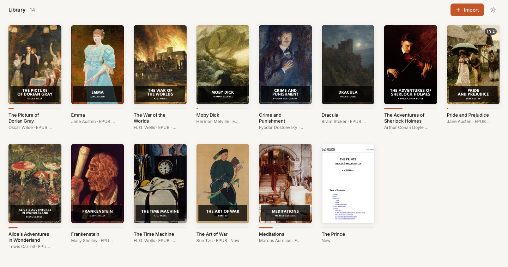
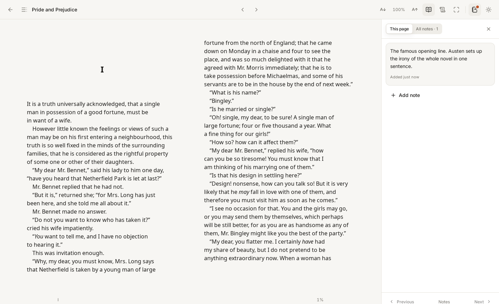
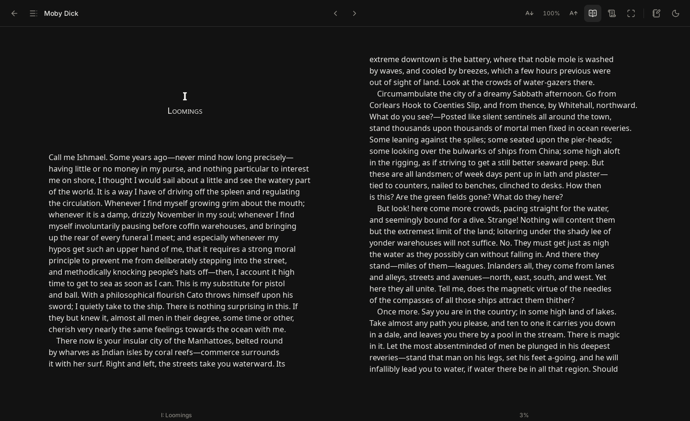
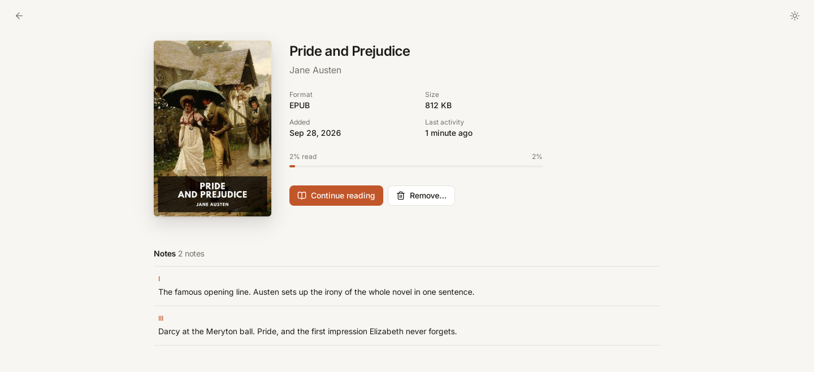
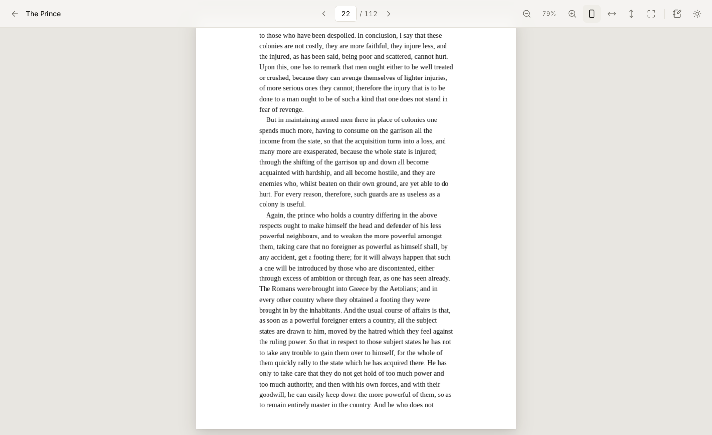

# Oikotheke

A local-first desktop app to organize, read and annotate your PDF and EPUB books. Your files,
reading progress and notes never leave your machine — no account, no cloud, no telemetry.

The name comes from Greek *oîkos* (home) + *thḗkē* (case, repository): the home shelf.



## Features

- **A shelf, not a file list.** Import PDF and EPUB books with the file picker or drag and drop;
  each one gets a cover, its title and author, and a reading-progress bar.
- **Free books to start with.** Discover lists 30 hand-picked, freely licensed books —
  Portuguese and English classics and programming books — that download from their official
  sources and import in one click.
- **Your own copy.** Every imported book is copied into the app's storage, so moving or deleting
  the original never breaks your library.
- **Comfortable reading.** PDFs page by page with zoom and fit modes; EPUBs as book-like pages or
  a continuous scroll, with contents, adjustable font size, and light or dark themes. Focus mode
  hides everything but the text.
- **Picks up where you left off.** Your position is saved as you read and restored when you
  reopen a book, even after restarting the app.
- **Notes on any page.** Write notes while reading, see which pages have them, jump between
  them, and review them all on the book's page.
- **Safe with untrusted books.** EPUB content can't run scripts or reach the network, and web
  links only open in your browser after you confirm.

| | |
|---|---|
|  |  |
| Notes next to the text, marked on the page | Dark mode, two-page layout |
|  |  |
| Book details: progress and every note | PDF reader with zoom and fit modes |

<sub>Sample books are public-domain editions from [Standard Ebooks](https://standardebooks.org).</sub>

## Stack

- [Tauri 2](https://tauri.app) (Rust) — file storage, SQLite database, book serving, EPUB import
- React + TypeScript + Vite — UI (in `ui/`)
- Tailwind CSS v4, [pdf.js](https://mozilla.github.io/pdf.js/),
  [foliate-js](https://github.com/johnfactotum/foliate-js), [zip.js](https://gildas-lormeau.github.io/zip.js/)

## Install on Windows

Download
[`Oikotheke-windows-x64-setup.exe`](https://github.com/marcos-venicius/oikotheke/releases/latest/download/Oikotheke-windows-x64-setup.exe)
from the [latest release](https://github.com/marcos-venicius/oikotheke/releases/latest) and run
it (Windows 10/11, 64-bit; installs for your user, no administrator rights). The installer isn't
code-signed yet, so SmartScreen may warn: choose *More info* → *Run anyway*.

## Install on Linux

Requires WebKitGTK 4.1 at runtime (`libwebkit2gtk-4.1-0` on Debian/Ubuntu). Building needs
Node 20+ and Rust stable.

```sh
scripts/install.sh              # build and install for your user (~/.local)
scripts/install.sh --system     # install for all users (/usr/local, sudo for copying only)
scripts/install.sh --skip-build # reuse an existing release build
```

Oikotheke then appears in your applications menu. To remove it:

```sh
scripts/uninstall.sh            # removes the app, keeps your library
scripts/uninstall.sh --purge    # also deletes stored books, notes and progress (asks first)
```

Use the same `--system` / `--prefix DIR` flag you installed with. Your library lives in
`~/.local/share/io.github.marcos-venicius.oikotheke`. A library from the app's former
name, PDF Shelf, is moved there automatically on first launch.

## Development

Prerequisites: Node 20+, Rust stable, and the [Tauri system dependencies](https://tauri.app/start/prerequisites/).

```sh
npm install
npm run tauri dev      # run the app
npm test               # frontend unit tests
npm run lint
cd src-tauri && cargo test   # backend tests
npm run tauri build    # production bundle
```

## Project layout

```text
ui/          React frontend (features, services, styles)
src-tauri/   Rust backend (db, storage, services, commands)
scripts/     Linux install/uninstall, pdf.js asset copy
assets/      App icon source (app-icon.svg)
docs/        Website (GitHub Pages) and screenshots
CHANGELOG.md Release notes
PROGRESS.md  Implementation progress and development notes
```

## Releases

Oikotheke follows [Semantic Versioning](https://semver.org); see [CHANGELOG.md](CHANGELOG.md).
Pushing a new version to `main` builds the Windows installer, tags the version and publishes
a GitHub release with it. To bump it:

```sh
node scripts/version.mjs set 1.1.0   # updates package.json, Cargo.toml, tauri.conf.json, locks
```

## License

[MIT](LICENSE) © 2026 Marcos Sousa
